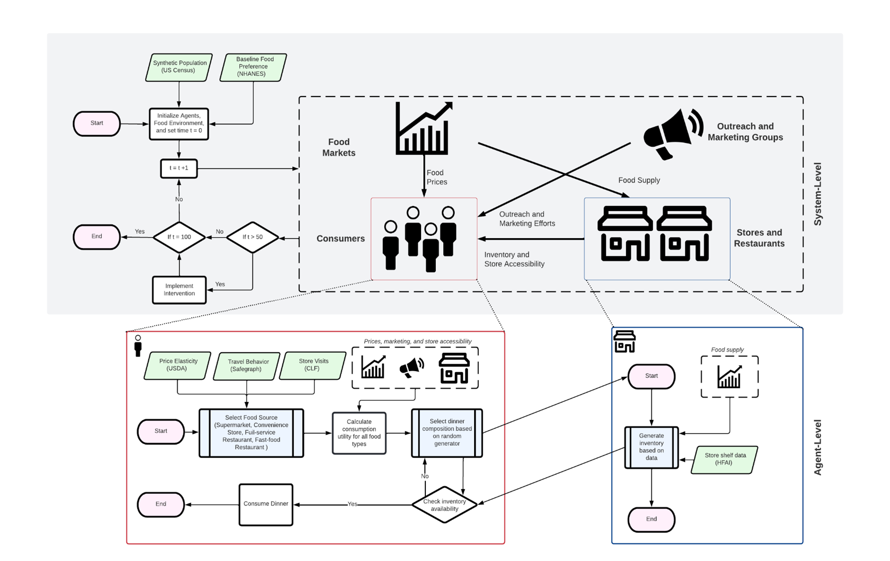

# Baltimore Food Consumption Agent-Based Model

[](https://www.python.org/downloads/release/python-360/)

This repo contains the developed Center for a Livable Future (CLF) meat consumption agent-based model that simulate the dinner consumption patterns of all residential zipcodes in Baltimore City. The results of this model was reported in the study titled, *Using an Agent-Based Model to Evaluate Selected Factors Affecting Meat Reduction Strategies: A Baltimore City Case Study* that is submitted in *Frontiers Nutrition*. The agent-based model is coded using Python 3.6. The post-processing and data analysis was conducted using R 4.2.1. An overview of the model process is shown below in the image.




## Getting Started
The following instructions will show the user how the Baltimore Food Consumption ABM can be run from a desktop computer.

### Prerequisite
Interpreters for the following general purpose programming language packages must be installed for the ABM to run.
* Python 3.6
* R 4.2.1

In addition to the following language interpreters. The following python libraries must be imported.
- numpy
- scipy
- multiprocessing
- pandas
- datetime
- random
- matplotlib

### Usage
The code can be executed via command line interface such as Bash. The following command can be simply exectued as
```sh
python3 RunModel.py
```
There are two main scripts that can be executed: `RunModel.py` and `RunSensitivityAnalysis.py`. `RunModel.py` will execute the agent based model with the same parameters that were used in the referenced paper. In that script, all scenarios will be executed in our model which includes five scenarios:

* Baseline Scenario. No interventions (`Baseline`)
* Scenario 1. Implementation of non-meat marketing campaign (`MeatlessMondayMarketing`)
* Scenario 2. Increase in meat pricing (`PriceSurge`)
* Scenario 3. Increase in availability of non-meat options (`MoreMeatlessOptions`)
* Scenario 4. Combined non-meat push (`ComprehensiveMarketing`)

Additionally, the simualtion includes two scenarios (`SupplyShock` and `COVID`) that were not analyzed in the study. After the simualation completes All output data will exported to the newly created data ``Output`` folder. The output files are all formatted as comma-separated values (csv) files. Each file corresponds to a zip-code and sociodemographic group, stratified by race, income, and poverty status and named in such a way (e.g., `FoodConsumption21201Income_$25k - $55k.csv`) The consumed units for each individual food group are recorded for each time step. The file contains the total unit The output files is exported into subfolders labeled by their scenario name + run number (e.g., `PriceSurge3`).

The `RunSensitivityAnalysis.py` script will execute the sensitivity analysis where the multipliers associated with the agent's utility function are incrementally adjusted. The output for this analysis will also be produced in the `Output` folder into subfolders labeled by the intervention(s) name + sensitivity muliplier (e.g., `PriceSurge1.5_Marketing0.5`). the script can be executed with the following Bash command:

```sh
python3 RunSensitivityAnalysis.py
```

The input data folder, labeled `data` contains all the parameter values (`GlobalParms.csv` and `ChorotParms.csv`) and input data such as price elasticity, marketing efforts, population data, supply levels, visit data, and food prices.

### Post-hoc Data Analysis
The post-hoc analysis of the data is done using the R scripts in the `RScriptsPlot` folder. The figures in the study can all be reproduced using the R Scripts after the outputs are compiled into the `Output` folder.

## Acknowledgments
* Project funded and managed by the [Johns Hopkins Center for a Livable Future (CLF)](https://clf.jhsph.edu/)
* Model and code developed by Gary Lin, PhD - [@GaryLin89](https://twitter.com/garylin89)

## License
Distributed under the MIT License. See ``LICENSE`` for more information.
